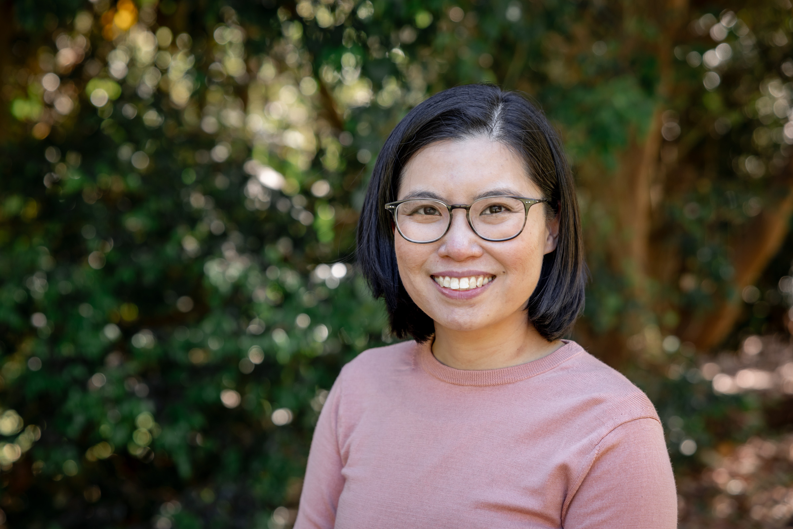

:::::: bio-container
::: bio-photo

:::

:::: bio-text
# Dr. Diana Tan

**ARC DECRA Fellow & Senior Research Fellow**\
Olga Tennison Autism Research Centre, La Trobe University

I am an ARC DECRA Fellow and a Senior Research Fellow at the Olga Tennison Autism Research Centre, La Trobe University. My research sits at the intersection of autism, neurodiversity, and inclusion. My work spans three interconnected areas: the experiences of Autistic people with stigma and social marginalisation; inclusion of neurodivergent students and staff in higher education; and the theory and practice of participatory autism research. Across these areas, I am particularly interested in how research processes themselves can either reinforce or challenge the marginalisation that Autistic and otherwise neurodivergent people experience.

I completed my PhD in Psychology at the University of Western Australia in 2018, and since then have built a programme of research focused on understanding and dismantling the structural and social barriers that shape Autistic people's lives. I also serve as Secretary of the Australasian Society for Autism Research (ASfAR), where I work to support and connect the autism research community across the Asia Pacific regions.

Outside of research, you'll find me in the kitchen, out on a run or in the pool, deep in an anime series, or — most likely — chasing my toddler around.

::: bio-links
<a href="mailto:diana.tan@latrobe.edu.au">✉ Email</a> <a href="https://scholar.google.com.au/citations?user=zTvxhfps61QC" target="_blank">Google Scholar</a> <a href="https://orcid.org/0000-0002-6394-8435" target="_blank">ORCID</a> <a href="https://github.com/dianawtan" target="_blank">GitHub</a> <a href="https://www.linkedin.com/in/diana-w-tan/" target="_blank">LinkedIn</a> <a href="https://bsky.app/profile/dianatan.bsky.social" target="_blank">🦋 Bluesky</a> <a href="https://scholars.latrobe.edu.au/d2tan" target="_blank">La Trobe Profile</a> <a href="cv.qmd">CV</a>
:::
::::
::::::
